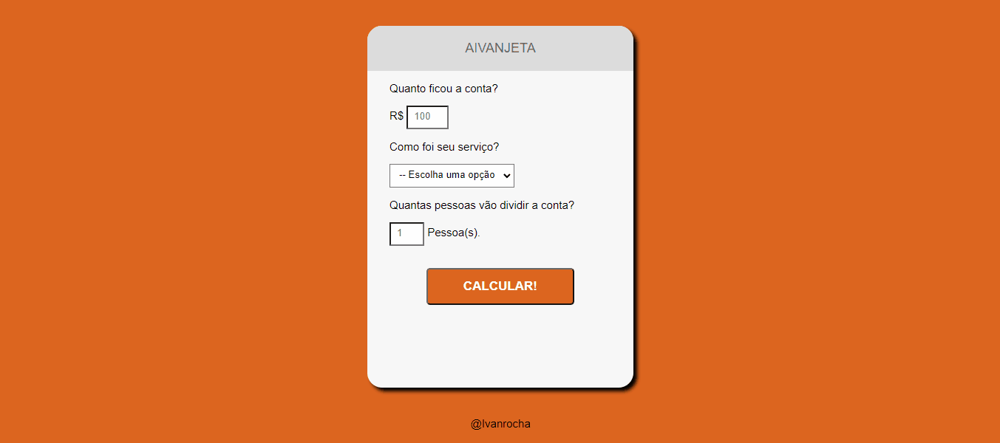

# 🤟🏽 AivanJeta

AivanJeta surgiu como um teste gratuito oferecido pelo curso da OneBitCode, uma oportunidade para a plataforma demonstrar sua metodologia de ensino. Naquela época, eu estava em um dilema sobre investir ou não no curso, considerando o alto custo envolvido. Infelizmente, minhas condições financeiras eram limitadas na ocasião, intensificando minhas hesitações. Pairava em mim um receio de que o curso pudesse ser enganoso ou não oferecesse o valor prometido. Contudo, acabei por adquirir o curso e posso afirmar com convicção que se destaca como um dos melhores que já participei. Sua qualidade é inegável, tornando o investimento completamente válido.

Agora, deixando as delongas de lado, concentremo-nos no próprio projeto, o AivanJeta. Este é o quinto ou quarto projeto que desenvolvi ao longo de minha jornada, e embora possa ser considerado um dos mais simples, é indubitavelmente um dos mais refinados e otimizados.

O propósito do AivanJeta é complementar outros projetos, sendo um deles o AivanCoffee. Nesse contexto, um cliente que faz um pedido pelo AivanCoffee pode, posteriormente, utilizar o AivanJeta para calcular uma gorjeta apropriada tanto para o restaurante quanto para o garçom. Esse cálculo é baseado em fatores como o valor total da conta, a qualidade do serviço prestado e o número de pessoas presentes. O sistema atribui um valor justo de gorjeta para cada indivíduo, garantindo que a divisão seja equitativa.

O AivanJeta não se restringe exclusivamente a restaurantes, mas pode ser aplicado a uma variedade de serviços que envolvem atendimento e qualidade. Seu propósito é abrangente, abarcando diversos setores que valorizam um bom atendimento e desejam recompensar adequadamente os prestadores de serviço.

## 📺 Demonstração

## 💻 Tech Stack:

## 🚀 Referência/Material

- [Site](https://start.onebitcode.com/)
- [Youtube](https://www.youtube.com/watch?v=t38ghwOrrqA)
- [Curso](https://www.onebitcode.com/?gclid=Cj0KCQjwi7GnBhDXARIsAFLvH4kCLMueqTh8KgNNg8nbrxvnlQeboXJ4S__ujU-NRIvsjRpiACbxYnYaAqWREALw_wcB&ref=W85867126G)

## 🔗 Licença

- [MIT License](https://choosealicense.com/licenses/mit/)

## ⭐ Suporte/Feedback

- Para suporte ou feedback, entrar em contato via email (ivan.rocha.0987@gmail.com) ou entre em contato via whatsapp (41) 98468-5317.

## 🚩 Autores

- [@IvanRocha](https://www.github.com/ivanrocha10)
- [@OneBitCode](https://github.com/OneBitCodeBlog)

## 🔥 Projeto

  Acesse o "AivanJeta" pelo QR:

  

Caso o QR não funcione, acesse <a href="https://ivanrocha10.github.io/AivanJeta/">aqui</a>
